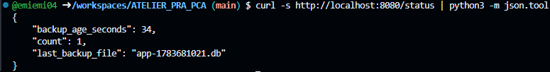

------------------------------------------------------------------------------------------------------
ATELIER PRA/PCA
------------------------------------------------------------------------------------------------------
L’idée en 30 secondes : Cet atelier met en œuvre un **mini-PRA** sur **Kubernetes** en déployant une **application Flask** avec une **base SQLite** stockée sur un **volume persistant (PVC pra-data)** et des **sauvegardes automatiques réalisées chaque minute vers un second volume (PVC pra-backup)** via un **CronJob**. L’**image applicative est construite avec Packer** et le **déploiement orchestré avec Ansible**, tandis que Kubernetes assure la gestion des pods et de la disponibilité applicative. Nous observerons la différence entre **disponibilité** (recréation automatique des pods sans perte de données) et **reprise après sinistre** (perte volontaire du volume de données puis restauration depuis les backups), nous mesurerons concrètement les RTO et RPO, et comprendrons les limites d’un PRA local non répliqué. Cet atelier illustre de manière pratique les principes de continuité et de reprise d’activité, ainsi que le rôle respectif des conteneurs, du stockage persistant et des mécanismes de sauvegarde.
  
**Architecture cible :** Ci-dessous, voici l'architecture cible souhaitée.   
  
  
  
-------------------------------------------------------------------------------------------------------
Séquence 1 : Codespace de Github
-------------------------------------------------------------------------------------------------------
Objectif : Création d'un Codespace Github  
Difficulté : Très facile (~5 minutes)
-------------------------------------------------------------------------------------------------------
**Faites un Fork de ce projet**. Si besoin, voici une vidéo d'accompagnement pour vous aider à "Forker" un Repository Github : [Forker ce projet](https://youtu.be/p33-7XQ29zQ) 
  
Ensuite depuis l'onglet **[CODE]** de votre nouveau Repository, **ouvrez un Codespace Github**.
  
---------------------------------------------------
Séquence 2 : Création du votre environnement de travail
---------------------------------------------------
Objectif : Créer votre environnement de travail  
Difficulté : Simple (~10 minutes)
---------------------------------------------------
Vous allez dans cette séquence mettre en place un cluster Kubernetes K3d contenant un master et 2 workers, installer les logiciels Packer et Ansible. Depuis le terminal de votre Codespace copier/coller les codes ci-dessous étape par étape :  

**Création du cluster K3d**  
```
curl -s https://raw.githubusercontent.com/k3d-io/k3d/main/install.sh | bash
```
```
k3d cluster create pra \
  --servers 1 \
  --agents 2
```
**vérification de la création de votre cluster Kubernetes**  
```
kubectl get nodes
```
**Installation du logiciel Packer (création d'images Docker)**  
```
PACKER_VERSION=1.11.2
curl -fsSL -o /tmp/packer.zip \
  "https://releases.hashicorp.com/packer/${PACKER_VERSION}/packer_${PACKER_VERSION}_linux_amd64.zip"
sudo unzip -o /tmp/packer.zip -d /usr/local/bin
rm -f /tmp/packer.zip
```
**Installation du logiciel Ansible**  
```
python3 -m pip install --user ansible kubernetes PyYAML jinja2
export PATH="$HOME/.local/bin:$PATH"
ansible-galaxy collection install kubernetes.core
```
  
---------------------------------------------------
Séquence 3 : Déploiement de l'infrastructure
---------------------------------------------------
Objectif : Déployer l'infrastructure sur le cluster Kubernetes
Difficulté : Facile (~15 minutes)
---------------------------------------------------  
Nous allons à présent déployer notre infrastructure sur Kubernetes. C'est à dire, créér l'image Docker de notre application Flask avec Packer, déposer l'image dans le cluster Kubernetes et enfin déployer l'infratructure avec Ansible (Création du pod, création des PVC et les scripts des sauvegardes aututomatiques).  

**Création de l'image Docker avec Packer**  
```
packer init .
packer build -var "image_tag=1.0" .
docker images | head
```
  
**Import de l'image Docker dans le cluster Kubernetes**  
```
k3d image import pra/flask-sqlite:1.0 -c pra
```
  
**Déploiment de l'infrastructure dans Kubernetes**  
```
ansible-playbook ansible/playbook.yml
```
  
**Forward du port 8080 qui est le port d'exposition de votre application Flask**  
```
kubectl -n pra port-forward svc/flask 8080:80 >/tmp/web.log 2>&1 &
```
  
---------------------------------------------------  
**Réccupération de l'URL de votre application Flask**. Votre application Flask est déployée sur le cluster K3d. Pour obtenir votre URL cliquez sur l'onglet **[PORTS]** dans votre Codespace (à coté de Terminal) et rendez public votre port 8080 (Visibilité du port). Ouvrez l'URL dans votre navigateur et c'est terminé.  

**Les routes** à votre disposition sont les suivantes :  
1. https://...**/** affichera dans votre navigateur "Bonjour tout le monde !".
2. https://...**/health** pour voir l'état de santé de votre application.
3. https://...**/add?message=test** pour ajouter un message dans votre base de données SQLite.
4. https://...**/count** pour afficher le nombre de messages stockés dans votre base de données SQLite.
5. https://...**/consultation** pour afficher les messages stockés dans votre base de données.
  
---------------------------------------------------  
### Processus de sauvegarde de la BDD SQLite

Grâce à une tâche CRON déployée par Ansible sur le cluster Kubernetes (un CronJob), toutes les minutes une sauvegarde de la BDD SQLite est faite depuis le PVC pra-data vers le PCV pra-backup dans Kubernetes.  

Pour visualiser les sauvegardes périodiques déposées dans le PVC pra-backup, coller les commandes suivantes dans votre terminal Codespace :  

```
kubectl -n pra run debug-backup \
  --rm -it \
  --image=alpine \
  --overrides='
{
  "spec": {
    "containers": [{
      "name": "debug",
      "image": "alpine",
      "command": ["sh"],
      "stdin": true,
      "tty": true,
      "volumeMounts": [{
        "name": "backup",
        "mountPath": "/backup"
      }]
    }],
    "volumes": [{
      "name": "backup",
      "persistentVolumeClaim": {
        "claimName": "pra-backup"
      }
    }]
  }
}'
```
```
ls -lh /backup
```
**Pour sortir du cluster et revenir dans le terminal**
```
exit
```

---------------------------------------------------
Séquence 4 : 💥 Scénarios de crash possibles  
Difficulté : Facile (~30 minutes)
---------------------------------------------------
### 🎬 **Scénario 1 : PCA — Crash du pod**  
Nous allons dans ce scénario **détruire notre Pod Kubernetes**. Ceci simulera par exemple la supression d'un pod accidentellement, ou un pod qui crash, ou un pod redémarré, etc..

**Destruction du pod :** Ci-dessous, la cible de notre scénario   
  
  

Nous perdons donc ici notre application mais pas notre base de données puisque celle-ci est déposée dans le PVC pra-data hors du pod.  

Copier/coller le code suivant dans votre terminal Codespace pour détruire votre pod :
```
kubectl -n pra get pods
```
Notez le nom de votre pod qui est différent pour tout le monde.  
Supprimez votre pod (pensez à remplacer <nom-du-pod-flask> par le nom de votre pod).  
Exemple : kubectl -n pra delete pod flask-7c4fd76955-abcde  
```
kubectl -n pra delete pod <nom-du-pod-flask>
```
**Vérification de la suppression de votre pod**
```
kubectl -n pra get pods
```
👉 **Le pod a été reconstruit sous un autre identifiant**.  
Forward du port 8080 du nouveau service  
```
kubectl -n pra port-forward svc/flask 8080:80 >/tmp/web.log 2>&1 &
```
Observez le résultat en ligne  
https://...**/consultation** -> Vous n'avez perdu aucun message.
  
👉 Kubernetes gère tout seul : Aucun impact sur les données ou sur votre service (PVC conserve la DB et le pod est reconstruit automatiquement) -> **C'est du PCA**. Tout est automatique et il n'y a aucune rupture de service.
  
---------------------------------------------------
### 🎬 **Scénario 2 : PRA - Perte du PVC pra-data** 
Nous allons dans ce scénario **détruire notre PVC pra-data**. C'est à dire nous allons suprimer la base de données en production. Ceci simulera par exemple la corruption de la BDD SQLite, le disque du node perdu, une erreur humaine, etc. 💥 Impact : IL s'agit ici d'un impact important puisque **la BDD est perdue**.  

**Destruction du PVC pra-data :** Ci-dessous, la cible de notre scénario   
  
  

🔥 **PHASE 1 — Simuler le sinistre (perte de la BDD de production)**  
Copier/coller le code suivant dans votre terminal Codespace pour détruire votre base de données :
```
kubectl -n pra scale deployment flask --replicas=0
```
```
kubectl -n pra patch cronjob sqlite-backup -p '{"spec":{"suspend":true}}'
```
```
kubectl -n pra delete job --all
```
```
kubectl -n pra delete pvc pra-data
```
👉 Vous pouvez vérifier votre application en ligne, la base de données est détruite et la service n'est plus accéssible.  

✅ **PHASE 2 — Procédure de restauration**  
Recréer l’infrastructure avec un PVC pra-data vide.  
```
kubectl apply -f k8s/
```
Vérification de votre application en ligne.  
Forward du port 8080 du service pour tester l'application en ligne.  
```
kubectl -n pra port-forward svc/flask 8080:80 >/tmp/web.log 2>&1 &
```
https://...**/count** -> =0.  
https://...**/consultation** Vous avez perdu tous vos messages.  

Retaurez votre BDD depuis le PVC Backup.  
```
kubectl apply -f pra/50-job-restore.yaml
```
👉 Vous pouvez vérifier votre application en ligne, **votre base de données a été restaureé** et tous vos messages sont bien présents.  

Relance des CRON de sauvgardes.  
```
kubectl -n pra patch cronjob sqlite-backup -p '{"spec":{"suspend":false}}'
```
👉 Nous n'avons pas perdu de données mais Kubernetes ne gère pas la restauration tout seul. Nous avons du protéger nos données via des sauvegardes régulières (du PVC pra-data vers le PVC pra-backup). -> **C'est du PRA**. Il s'agit d'une stratégie de sauvegarde avec une procédure de restauration.  

---------------------------------------------------
Séquence 5 : Exercices  
Difficulté : Moyenne (~45 minutes)
---------------------------------------------------
**Complétez et documentez ce fichier README.md** pour répondre aux questions des exercices.  
Faites preuve de pédagogie et soyez clair dans vos explications et procedures de travail.  

**Exercice 1 :**  
Quels sont les composants dont la perte entraîne une perte de données ?  

- **Le PVC `pra-data`** : c'est là que vit la base SQLite en production. S'il est perdu (suppression, corruption, disque du node détruit), toutes les données écrites depuis la **dernière sauvegarde** sont perdues (jusqu'à 1 minute, la fréquence du CronJob).
- **Le PVC `pra-backup`** : s'il est perdu **en même temps** que `pra-data` (par exemple parce que les deux volumes sont hébergés sur le même disque/node K3d), il n'y a alors plus aucun moyen de restaurer quoi que ce soit → perte totale et définitive.
- **Le node/disque du Codespace lui-même** : dans ce lab, K3d utilise le provisioner `local-path`, qui stocke les volumes sur le disque local du node. Si ce node (donc le Codespace) disparaît, `pra-data` **et** `pra-backup` sont perdus simultanément.

À l'inverse, la **perte du pod `flask`** (Scénario 1) n'entraîne **aucune** perte de données : le pod est stateless, ses données vivent exclusivement dans le PVC `pra-data`, monté indépendamment du cycle de vie du pod.

**Exercice 2 :**  
Expliquez nous pourquoi nous n'avons pas perdu les données lors de la supression du PVC pra-data  

Nous n'avons pas *réellement* évité toute perte : nous avons seulement limité la perte à la fenêtre écoulée depuis la dernière sauvegarde (au pire 1 minute). Ce qui nous a permis de récupérer l'essentiel des données, c'est que :

1. **Le CronJob `sqlite-backup`** copie, chaque minute, le fichier `app.db` du PVC `pra-data` vers un **second volume physiquement distinct**, le PVC `pra-backup`.
2. Quand `pra-data` est supprimé, **`pra-backup` n'est pas affecté** : c'est un volume Kubernetes séparé, avec son propre cycle de vie.
3. La procédure de restauration recrée un `pra-data` vide (`kubectl apply -f k8s/`), puis exécute un `Job` (`pra/50-job-restore.yaml`) qui copie le fichier de sauvegarde le plus récent de `pra-backup` vers le nouveau `pra-data`.

En clair : **on n'a pas protégé le volume de données lui-même, on a dupliqué son contenu ailleurs à intervalle régulier.** C'est le principe même d'une stratégie de sauvegarde/restauration (PRA), à distinguer d'une stratégie de haute disponibilité (PCA, Scénario 1) où c'est l'infrastructure qui garantit qu'aucune donnée n'est jamais perdue.

**Exercice 3 :**  
Quels sont les RTO et RPO de cette solution ?  

- **RPO (Recovery Point Objective — perte de données maximale tolérée) : ~1 minute.**  
  C'est la fréquence du `CronJob sqlite-backup` (`schedule: "*/1 * * * *"`). Dans le pire cas, le sinistre survient juste avant l'exécution du prochain backup : on perd donc jusqu'à 1 minute d'écritures (les messages ajoutés via `/add`).

- **RTO (Recovery Time Objective — temps d'indisponibilité maximal toléré) : de l'ordre de 1 à 3 minutes**, mais **entièrement manuel** dans cet atelier. Il correspond à la somme de :
  - `kubectl apply -f k8s/` pour recréer le namespace/PVC/Deployment/Service (~10-20s) ;
  - le redémarrage du pod Flask et son passage en `Ready` (~5-15s) ;
  - l'exécution du Job de restauration (`kubectl apply -f pra/50-job-restore.yaml` + attente de complétion, ~5-10s) ;
  - **le temps de décision et d'exécution humaine** des commandes (le facteur le plus significatif ici, puisque rien n'est déclenché automatiquement).

**Exercice 4 :**  
Pourquoi cette solution (cet atelier) ne peux pas être utilisé dans un vrai environnement de production ? Que manque-t-il ?   

- **Single point of failure au niveau du stockage** : `pra-data` et `pra-backup` utilisent tous deux le provisioner `local-path` de K3d, c'est-à-dire le disque local d'un seul node. Si ce node/disque disparaît, **on perd la donnée et sa sauvegarde en même temps** — ce qui va justement à l'encontre de l'objectif d'un PRA (les sauvegardes doivent être hébergées ailleurs que la production).
- **Cluster mono-node K3d, sans haute disponibilité réelle** : un seul master, pas de multi-AZ ni de multi-région.
- **SQLite n'est pas fait pour la production à charge réelle** : pas de réplication native, accès concurrent en écriture limité, aucun mécanisme de failover.
- **Aucune sauvegarde externalisée (offsite)** : les backups devraient être copiés vers un stockage objet externe (S3, GCS, Azure Blob…), dans un autre compte/région, avec une politique de rétention et de versioning.
- **Pas de vérification d'intégrité des sauvegardes** : on ne teste jamais qu'un backup est réellement restaurable (pas de "restore drill" automatisé, pas de checksum).
- **Restauration 100% manuelle** : aucune supervision ni détection automatique du sinistre, aucun déclenchement automatique de la restauration, donc un RTO qui dépend entièrement de la rapidité (et de la disponibilité !) d'un opérateur humain.
- **Absence de sécurité** : pas de gestion de secrets, pas de TLS, pas de RBAC ni de NetworkPolicy pour restreindre les accès entre le pod applicatif et les jobs de backup/restore.
- **Un seul réplica applicatif** (`replicas: 1`), donc aucune redondance côté calcul au-delà du redémarrage automatique du pod par Kubernetes.
- **Pas de monitoring/alerting** : rien ne prévient qu'un backup a échoué ou que la fenêtre de RPO est dépassée.
  
**Exercice 5 :**  
Proposez une archtecture plus robuste.   

Une architecture PRA/PCA plus solide combinerait :

1. **Un cluster Kubernetes managé multi-node et multi-AZ** (EKS, GKE, AKS…) plutôt qu'un K3d mono-node local, pour survivre à la perte d'un node ou d'une zone de disponibilité.
2. **Une base de données managée et répliquée** (PostgreSQL en Multi-AZ, par exemple) à la place de SQLite, avec réplication synchrone/asynchrone entre au moins deux instances.
3. **Un stockage persistant répliqué** (volumes cloud avec réplication inter-AZ, ou solution distribuée type Longhorn/Ceph) au lieu du `local-path` provisioner, pour que la perte d'un disque ne soit plus critique.
4. **Des sauvegardes externalisées (offsite)**, versionnées, vers un stockage objet dans un **compte ou une région distincte** (ex : S3 + réplication cross-region, avec politique de rétention et chiffrement).
5. **Des restaurations testées automatiquement** (restore drills périodiques et automatisés, avec vérification de checksum), pour garantir que les backups sont réellement exploitables le jour J.
6. **Une orchestration outillée** (ex : [Velero](https://velero.io/) pour la sauvegarde/restauration native Kubernetes, associé à des CronJobs applicatifs pour la base de données).
7. **Plusieurs réplicas applicatifs** derrière le Service, avec des probes de liveness/readiness, pour absorber la perte d'un pod sans interruption perceptible.
8. **Monitoring et alerting** (Prometheus/Grafana + alertes) sur l'échec des sauvegardes, l'âge du dernier backup (justement exposé par notre nouvelle route `/status` !) et la santé du cluster.
9. **Une automatisation complète de la bascule** (scripts/Ansible/Operator déclenchés automatiquement sur détection de sinistre) pour réduire le RTO, au lieu d'une procédure manuelle comme dans cet atelier.

Cette architecture rapprocherait le système d'un vrai objectif de continuité (PCA) plutôt que d'une simple stratégie de sauvegarde/restauration locale (PRA), tout en réduisant fortement le RTO et le RPO.

---------------------------------------------------
Séquence 6 : Ateliers  
Difficulté : Moyenne (~2 heures)
---------------------------------------------------
### **Atelier 1 : Ajoutez une fonctionnalité à votre application**  
**Ajouter une route GET /status** dans votre application qui affiche en JSON :
* count : nombre d’événements en base
* last_backup_file : nom du dernier backup présent dans /backup
* backup_age_seconds : âge du dernier backup



---------------------------------------------------
### **Atelier 2 : Choisir notre point de restauration**  
Aujourd’hui nous restaurobs “le dernier backup”. Nous souhaitons **ajouter la capacité de choisir un point de restauration**.

**Implémentation :**

Le Job de restauration statique `pra/50-job-restore.yaml` (qui ne restaure que le dernier backup) a été **complété**, sans être supprimé, par :

- **`ansible/templates/job-restore.yaml.j2`** : un template Jinja2 du Job de restauration. Si une variable `restore_file` est fournie, le Job copie précisément `/backup/{{ restore_file }}` (et échoue proprement avec la liste des backups disponibles si le fichier n'existe pas) ; sinon il retombe sur le comportement historique (`ls -t /backup/*.db | head -1`, le plus récent).
- **`ansible/restore.yml`** : un playbook dédié qui :
  1. vérifie que le deployment `flask` existe ;
  2. **liste les points de restauration disponibles** en exécutant `ls` dans le pod `flask` (qui monte désormais `pra-backup` en lecture seule — cf. Atelier 1) ;
  3. si aucun `restore_file` n'est fourni : **affiche la liste et s'arrête**, sans rien modifier ;
  4. si un `restore_file` est fourni et valide : génère le Job à partir du template, le déploie, attend sa complétion, puis affiche ses logs.

**Runbook — Procédure de restauration à un point choisi**

1. **Constater l'incident** (application inaccessible, données incohérentes, alerte monitoring…).

2. **Geler l'état actuel** pour éviter d'écraser des preuves ou d'aggraver la situation :
   ```bash
   kubectl -n pra scale deployment flask --replicas=0
   kubectl -n pra patch cronjob sqlite-backup -p '{"spec":{"suspend":true}}'
   ```

3. **Lister les points de restauration disponibles** :
   ```bash
   ansible-playbook ansible/restore.yml
   ```
   Le playbook affiche la liste des fichiers de backup, triés du plus récent au plus ancien (ex : `app-1720003600.db`, `app-1720003540.db`, …). Le nom du fichier encode un timestamp Unix : `date -d @1720003600` permet de le convertir en date lisible pour choisir le bon point.

4. **(Si nécessaire) Recréer l'infrastructure** avec un `pra-data` sain :
   ```bash
   kubectl apply -f k8s/
   ```

5. **Restaurer le point choisi** :
   ```bash
   ansible-playbook ansible/restore.yml -e restore_file=app-1720003600.db
   ```
   Ou, pour restaurer explicitement le plus récent :
   ```bash
   ansible-playbook ansible/restore.yml -e restore_file=latest
   ```

6. **Vérifier la restauration** :
   ```bash
   kubectl -n pra scale deployment flask --replicas=1
   kubectl -n pra rollout status deployment/flask
   kubectl -n pra port-forward svc/flask 8080:80 >/tmp/web.log 2>&1 &
   curl -s http://localhost:8080/status | python3 -m json.tool
   curl -s http://localhost:8080/consultation | python3 -m json.tool
   ```
   Contrôler que `count` et le contenu de `/consultation` correspondent bien au point de restauration choisi.

7. **Reprendre les sauvegardes automatiques** une fois l'incident clos :
   ```bash
   kubectl -n pra patch cronjob sqlite-backup -p '{"spec":{"suspend":false}}'
   ```

8. **Documenter l'incident** (cause, point de restauration utilisé, données perdues le cas échéant entre le point choisi et l'incident) pour capitaliser sur le retour d'expérience.
    
---------------------------------------------------
Evaluation
---------------------------------------------------
Cet atelier PRA PCA, **noté sur 20 points**, est évalué sur la base du barème suivant :  
- Série d'exerices (5 points)
- Atelier N°1 - Ajout d'un fonctionnalité (4 points)
- Atelier N°2 - Choisir son point de restauration (4 points)
- Qualité du Readme (lisibilité, erreur, ...) (3 points)
- Processus travail (quantité de commits, cohérence globale, interventions externes, ...) (4 points) 
